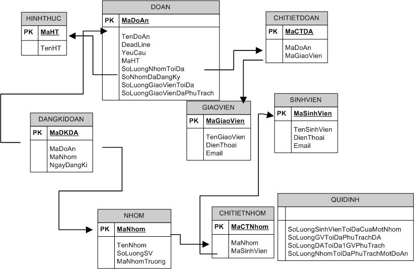

>Final project registration system


## Table of contents
1. [Requirements](#requirements)
	* [Introduction](#introduction)
	* [Rules](#rules)
		* [Teachers](#teachers)
		* [Students](#students)
		* [Administration](#administration)
		* [Others](#others)

2. [Deployed System](#deployed-system)
	* [Features](#features)
	* [Database design](#database-design)
	* [Store procedures](#store-procedures)
	* [Transaction conflicts and Deadlocks](transaction-conflicts-and-deadlocks)
		* [Scenario 1](#scenario-1)
		* [Scenario 2](#scenario-2)
		* [Scenario 3](#scenario-3)
		* [Scenario 4](#scenario-4)
		* [Scenario 5](#scenario-5)
		* [Scenario 6](#scenario-6)
		* [Scenario 7](#scenario-7)
		* [Scenario 8](#scenario-8)
		* [Scenario 9](#scenario-9)

---

### Requirements
#### Introduction
* The system has those features
	* Allow teachers to register projects (Personal or Group of student)
	* Teachers can give extra exercises for points, and there is a limit number of student for that.
	* Allow students to join any group, or project
	* Allow leader of a group register their project

#### Rules

* Everytime teachers register projects, they have permissions to give extra assignments to help students get points. There is a limit of number students who register.
* Teachers decide this number of students.
* Can withdraw a project before its deadline.
* After a deadline, students cannot register theis groups.
* Teachers can extend deadlines.

#### Features

##### Teachers
* Give assignments
* Read information his projects, assignments.
* Update status of projects/assignments: deadline, maximum member number, mamximum group number...

##### Students
* Group registration.
* Allow to register or withdraw projects.
* Move to another group / Ungroup.

##### Administration
* User creations
* Enable/Unenable projects.

##### Others
* Login/logout features.
* Add, delete, modify, update projects
...

---

### Deployed System

#### Features 

* Allow teachers to register projects `(add, delete, upgrade their projects)` with constrains `(group project, personal, max number...)`.
* Allow practical teachers to register his assistant.
* Allow students to register projects, withdraw projects with personal projects.
* Allow group leader to register projects, groups, and withdraw projects or groups.

#### Database design

Check the script [here](src/dbscript.sql) for this database 

* Abbreviation
	* `HINHTHUC`=`TYPE` table: Group or Personal.
		* `MaHT` = `TypeID` **PK**
		* `TenHT` = 'TypeName`
	* `DOAN` = `PROJECT` table
		* `MaDoAn` = `ProjectID` **PK**
		* `TenDoAn` = `ProjectName`
		* `DeadLine`
		* `YeuCau` = `Requirements`
		* `MaHT` = `TypeID`
		* `SoLuongNhomToiDa` = `MaxGroupNumber`
		* `SoLuongNhomDaDangKy` = `GroupRegistrationNumber`
		* `SoLuongGiaoVienToiDa` = `MaxTeacherNumber`
	* `CHITIETDOAN` = `PROJECTDETAIL` table
		* `MaCTDA` = `ProjectDetailID` **PK**
		* `MaDoAn` = `ProjectID`
		* `MaGiaoVien` = `TeacherID`
	* `SINHVIEN` = `STUDENT` table
		* `MaSinhVien` = `StudentID` **PK**
		* `TenSinhVien` = `StudentName`
		* `DienThoai` = `PhoneNumber`
		* `Email`
	* `GIAOVIEN` = `TEACHER` table
		* `MaGiaoVien` = `TeacherID` **PK**
		* `TenGiaoVien` = `TeacherName` 
		* `DienThoai` = `PhoneNumber`
		* `Email`
	* `DANGKIDOAN` = `PROJECTREGISTRATION` table
		* `MaDKDA` = `RegistrationID` **PK**
		* `MaDoAn` = `Project ID`
		* `MaNhom` = `GroupID`
		* `NgayDangKy` = `RegistrationDay`
	* `NHOM` = `GROUP` table
		* `MaNhom` = `GroupID` **PK**
		* `TenNhom` = `GroupName`
		* `SoLuongSV` = `MemberNumber`
		* `MaNhomTruong` = `LeaderID`
	* `CHITIETNHOM` = `GROUPDETAIL` table
		* `MaCTNhom` = `GroupDetailID` **PK**
		* `MaNhom` = `GroupID`
		* `MaSinhVien` = `StudentID`
	* `QUIDINH` = `RULE` table
		* `SoLuongSinhVienToiDaCuaMotNhom` = `MaxStudentOfaGroup`
		* `SoLuongGVToiDaPhuTrachDA` = `MaxTeacherOfaProject`
		* `SoLuongNhomToiDaPhuTrachMotDoAn` = `MaxGroupOfaProJect`

* Description
	* `PROJECT` table includes information about the project. Every project has `ProjectID` to distinguish with other projects. Every project has its name `ProjectName`, along with other information such as `DeadLine`, `Requirements`, `TypeID`, and maximum group number `MaxGroupNumber`.

	* `TYPE` table stores information about how to do this project. We have 
`TypeID` which means that `Project for groups` or `Personal project`, or `Extra assignment`

	* `PROJECTDETAIL` table shows which teacher is responsible for that project by using `ProjectDetailID`, and `TeacherID`. Many teachers are responsible for one project.

	* `PROJECTREGISTRATION` table includes information of sudents who registered (or groups). Which project did they register `ProjectID`, ID of students `GroupID`, and the day they registered `RegistrationDay`

	* `TEACHER` table shows information of teachers. Every teacher has his own ID `TeacherID` along with other information such as name of teachers `TeacherName`, phone number `PhoneNumber`, and email address `Email`

	* `STUDENT` table is similar to `TEACHER` table

	* `GROUP` shows information of registration groups. If the project is a personal project, group has only one student who is a group leader. There are `GroupID`, `GroupName`, `MemberNumber` How many member are there in the group, `LeaderID` ID of a group leader.

	* `GROUPDETAIL` table shows information of members in a group

	* `RULE` contains rules that set by teachers.


* Database diagram

	


#### Store Procedures

Build store procedures to perform requirements.

* `sp_GVUpdateDA` [Code](src/sp_GVUpdateDA.sql)
	* *Purpose*: A teacher wants to update old projects
	* *Variables*:
		* `@Ma_DA` *int* : Projet ID
		* `@TenDoAn` *nvarchar(50)* : Project name
		* `@dead_Lone` *datatime* : Deadline
		* `@yeu_cau` *nvarchar(50)* : Project requirements
		* `@MaHT` *int* : Type ID
		* `@SoLuongNhomToiDa` *int* : Max group number
		* `@SoLuongNhomToiDaDangKy` *int* : Number of group who registered projects
		* `@SoLuongGiaoVienToiDa` *int* : Max teacher number
		* `@SoLuongGiaoDaVienPhuTrach` *int* : Reponsible teacher number
	* *Process*:
		* Check the project
			* See if the project exists or not? If not shows errors, and quit.
			* Check the maximum group number.
		* If it satisfies
			* Check max teacher number > reponsible teacher number
				* If it satisfies, then update new information
				* Else show errors.
		* If it doesn't satisfy, show errors


* `sp_SVDangKyDA` [Code](src/sp_SVDangKyDA.sql)
	* *Purpose*: Students want to update old projects
	* *Variables*:
		* `@Ma_DA` *int* : Projet ID
		* `@Ma_Nhom` *int* : Group ID
		* `@NgayDangKy` *datatime* : Registration day
	* *Process*:
		* Check the project
			* See if the project exists or not? If not shows errors, and quit.
			* Check if the group registered or not. If yes, show errors and quit.
		* Check if the project is able to register.
			* Check the deadline.
			* Check max group number.
		* Check if the group exists or not.
		* Register the project.


* `sp_GVDocSuaDoAn` [Code](src/sp_GVDocSuaDoAn.sql)
	* *Purpose*: Teachers retrieve information of the project, and update it.
	* *Variables*:
		* `@Ma_DA` *int* : Projet ID
		* `@TenDoAn` *nvarchar(50)* : Project name
		* `@dead_Lone` *datatime* : Deadline
		* `@yeu_cau` *nvarchar(50)* : Project requirements
		* `@MaHT` *int* : Type ID
		* `@SoLuongNhomToiDa` *int* : Max group number
		* `@SoLuongNhomToiDaDangKy` *int* : Number of group who registered projects
		* `@SoLuongGiaoVienToiDa` *int* : Max teacher number
		* `@SoLuongGiaoDaVienPhuTrach` *int* : Reponsible teacher number
	* *Process*:
		* Check the project. If it doesn't exist then quit.
		* Read, and update the project.
			* Extract Project table.
			* Check the requirement update.
			* Update the project.
		* Read again the project.

* `sp_XemThongTinDangKyDoAn` [Code](src/sp_XemThongTinDangKyDoAn.sql)
	* *Purpose*: Retrieve information of projects
	* *Variables*:
		* `@Ma_DA` *int* : Projet ID
	* *Process*:
		* Show information

* `sp_SVHuyDangKyDA` [Code](src/sp_SVHuyDangKyDA.sql)
	* *Purpose*: Students withdraw registered projects.
	* *Variables*:
		* `@Ma_DA` *int* : Projet ID
		* `@Ma_Nhom` *int* : Group ID
	* *Process*:
		* Check if the project exists.
		* Check if the group registered the project or not?
		* Check the deadline.
		* Unregister the project
			* Update the number of group.
			* Delete information in `PROJECTREGISTRATION` table.

* `sp_GVThemDoAn` [Code](src/sp_GVThemDoAn.sql)
	* *Purpose*: Teachers add a new project.
	* *Variables*:
		* `@Ma_DA` *int* : Projet ID
		* `@TenDoAn` *nvarchar(50)* : Project name
		* `@dead_Lone` *datatime* : Deadline
		* `@yeu_cau` *nvarchar(50)* : Project requirements
		* `@MaHT` *int* : Type ID
		* `@SoLuongNhomToiDa` *int* : Max group number
		* `@SoLuongNhomToiDaDangKy` *int* : Number of group who registered projects
		* `@SoLuongGiaoVienToiDa` *int* : Max teacher number
		* `@SoLuongGiaoDaVienPhuTrach` *int* : Reponsible teacher number
	* *Process*:
		* Check if the project exists?
		* Check if the input is correct?
		* Insert a new record in the `PROJECT` table.

* `sp_SVDangKyNhom` [Code](src/sp_SVDangKyNhom.sql)
	* *Purpose*: Students withdraw registered projects.
	* *Variables*:
		* `@TenNhom` *nvarchar(50)* : Group name
		* `@SoLuongSV` *int* : Number of members in the group
		* `@MaNhomTruong` *int* : Group leader ID
	* *Process*:
		* Check if the group registered?
		* Check if the group leader id exists, and the input data?
		* Insert a new record in `GROUP` table.

* `sp_SVDocDoAn` [Code](src/sp_SVDocDoAn.sql)
	* *Purpose*: Student reads information of the project and print it out.
	* *Variables*:
		* `@Ma_DA` *int* : Projet ID
	* *Process*:
		* Check if the project exists?
		* Read information
			* Print out the project existence.
			* Print out max group number, and registration group number.

* `sp_GVHuyDoAn` [Code](src/sp_GVHuyDoAn.sql)
	* *Purpose*: Teachers want to withdraw a project.
	* *Variables*:
		* `@Ma_DA` *int* : Projet ID
	* *Process*:
		* Check if the project exists?
		* Withdraw the project
			* Delete information from `PROJECTDETAIL` table
			* Delete information from `PROJCETREGISTRATION` table
			* Delete information from `PROJECT` table

* `sp_DangKyPhuTrach` [Code](src/sp_DangKyPhuTrach.sql)
	* *Purpose*: Teachers want to withdraw a project.
	* *Variables*:
		* `@Ma_DA` *int* : Projet ID
		* `@Ma_GV` *int* : Teacher ID
	* *Process*:
		* Check if the project exists?
		* Check if the project has teachers who are responsible for?
		* Check if this teacher exists?
		* Teacher registration.

#### Transaction conflicts and Deadlocks

##### Scenario 1

| T1 - Student reads project information | T2 - Teacher withraws a project |
| :-------------: |:-------------:|
|**(1)** Check the project to see if it exists?     |  | 
| Waitfor delay ‘00:00:05’   | **(2)** Teacher withraws the project     |
|**(3)** Extract information | |

* Assumption: **(1)** -> **(2)** -> **(3)**
* T1 will give different information if he reads twice (Cannot read the information again)
	* `T1 : exec sp_SVDocDoAn 1`
	* `T2 : exec sp_GVHuyDoAn 1`
* The student is noticed the project existence, and wait for a while. After that, the student receives nothing because the project is deleted by a teacher.

* Solution: Use `isolation level REPEATABLE READ`

	```sql
	alter proc sp_SVDocDoAn
	@Ma_DA int
	as begin
	begin tran
	set tran isolation level REPEATABLE READ
		if(exists (select * from DoAn DA where DA.MaDoAn=@Ma_DA))
		begin
			print 'Project exists, please wait !'
			waitfor delay '00:00:05'
			select DA.SoLuongNhomToiDa, DA.SoLuongNhomDaDangKy from DoAn DA where DA.MaDoAn = @Ma_DA
		end
		else print 'Do an ko ton tai'
	commit tran
	end
	```

##### Scenario 2

| T1 - Project information update | T2 - Project registration |
| :-------------: |:-------------:|
|**(1)** A teacher modifies project information     |  | 
| Waitfor delay ‘00:00:05’   |   |
| | **(2)** A student reads new information   |
| | **(3)** The student registers project succesfully |
|**(4)** The transaction encounters errors, and is rollbacked | |

* Assumption: **(1)** -> **(2)** -> **(3)** -> **(4)**
	* `T1 : exec sp_GVUpdateDA 1`
	* `T2 : exec sp_SVDangKyDA 1`

* A teacher wants to modify information of a project. A student interferes to register. Teacher's transaction has errors and rollbacks. The student read the incorrect information from the teacher.
* Solution: Make sure that T1 is finished, then T2 will be processed. Use `isolation level READ COMMITTED`.

	```sql
	alter proc sp_GVUpdateDA 
	@Ma_DA int ,@TenDoAn nvarchar(50),@dead_Line datetime , @yeu_cau nvarchar(50),@MaHT int,@SoLuongNhomToiDa int,@SoLuongNhomDaDangKy int,@SoLuongGiaoVienToiDa int ,@SoLuongGiaoVienDaPhuTrach int 
	as begin
	begin tran 
		set tran isolation level READ COMMITTED
		if(not exists (select * from DoAn as DA where DA.MaDoAn=@Ma_DA)) 
		begin
			print 'Khong co do an nay'
	rollback
			return
		end
		if( @SoLuongNhomToiDa - (select DA.SoLuongNhomDaDangKy from DoAn As DA where DA.MaDoAn=@Ma_DA ) >= 0 )
		begin
			if( @SoLuongGiaoVienToiDa - (select DA.SoLuongGiaoVienDaPhuTrach from DoAn As DA where DA.MaDoAn=@Ma_DA ) >= 0 )
				update DoAn set TenDoAn=@TenDoAn,DeadLine=@dead_Line,YeuCau=@yeu_cau,MaHT=@MaHT,SoLuongNhomToiDa= @SoLuongNhomToiDa,SoLuongNhomDaDangKy=@SoLuongNhomDaDangKy,SoLuongGiaoVienToiDa=@SoLuongGiaoVienToiDa,SoLuongGiaoVienDaPhuTrach=@SoLuongGiaoVienDaPhuTrach where(DoAn.MaDoAn=@Ma_DA)		
			else print 'Ko update duoc so luong giao vien toi da moi nho hon so luong giao vien da phu trach'
		end
		else print 'Ko update duoc so nhom toi da moi nho hon so luong nhom da dang ky'

		select * from DoAn As DA where DA.MaDoAn=@Ma_DA 
	commit
	end
	```

##### Scenario 3

| T1 - Project information update | T2 - Project information update |
| :-------------: |:-------------:|
|**(1)** A teacher reads project information     |  | 
| Waitfor delay ‘00:00:10’   |   |
| | **(2)** Another teacher reads project information      |
| | Waitfor delay ‘00:00:10’  |
|**(3)** Modifies information of project||
| |**(4)** Modifies information of project|
|**(5)** Teacher reads again updated information | |

* Assumption: **(1)** -> **(2)** -> **(3)** -> **(4)** -> **(5)**
* The information from T1 is overwritten by T2 (Cannot read information again)
	* `T1 : exec sp_GVDocSuaDoAn 1,'abc','2/2/2010','abc',1,2,1,5,4`
	* `T2 : exec sp_GVDocSuaDoAn 1,'abcsctẽts','2/2/2010','abc',1,2,1,5,4`
* Teacher 1 reads information of a project, and waits for 10 seconds. After that he modies the project but when he reads again the information, it's totally different. Teacher 2 interferes teacher 1.
* Solution: Make sure that `T1 `is completed, then `T2` will be executed. 
	* Use `isolation level REPEATABLE READ`

	```sql
	alter proc sp_GVDocSuaDoAn
	@Ma_DA int ,@TenDoAn nvarchar(50),@dead_Line datetime , @yeu_cau nvarchar(50),@MaHT int,@SoLuongNhomToiDa int,@SoLuongNhomDaDangKy int,@SoLuongGiaoVienToiDa int ,@SoLuongGiaoVienDaPhuTrach int 

	as begin
	begin tran
		set tran isolation level REPEATABLE READ
		if(exists (select * from DoAn DA where DA.MaDoAn=@Ma_DA))
		begin	
			select* from DoAn DA where DA.MaDoAn = @Ma_DA
			waitfor delay '00:00:10'
	
			if( @SoLuongNhomToiDa - (select DA.SoLuongNhomDaDangKy from DoAn As DA where DA.MaDoAn=@Ma_DA ) >= 0 )
				begin
					if( @SoLuongGiaoVienToiDa - (select DA.SoLuongGiaoVienDaPhuTrach from DoAn As DA where DA.MaDoAn=@Ma_DA ) >= 0 )
						update DoAn set TenDoAn=@TenDoAn,DeadLine=@dead_Line,YeuCau=@yeu_cau,MaHT=@MaHT,SoLuongNhomToiDa= @SoLuongNhomToiDa,SoLuongNhomDaDangKy=@SoLuongNhomDaDangKy,SoLuongGiaoVienToiDa=@SoLuongGiaoVienToiDa,SoLuongGiaoVienDaPhuTrach=@SoLuongGiaoVienDaPhuTrach where(DoAn.MaDoAn=@Ma_DA)		
					else print 'Ko update duoc so luong giao vien toi da moi nho hon so luong giao vien da phu trach'
				end
			else print 'Ko update duoc so nhom toi da moi nho hon so luong nhom da dang ky'
		end
		select* from DoAn DA where DA.MaDoAn = @Ma_DA

	commit
	end
	```

##### Scenario 4

| T1 - Project registration| T2 - Teacher updates a project |
| :-------------: |:-------------:|
|**(1)** A student checks max group number, and registers a project    |  | 
| Waitfor delay ‘00:00:10’   |     |
| | **(2)** Teacher changes max group number |
|**(3)** The student egisters the project | |

* Assumption: **(1)** -> **(2)** -> **(3)**
* T1 is writing the data, but T2 interferes and changes the data (Phantom, lost updated data)
	* `T1 : exec sp_DangKyDA 1,2,'4/02/2010'`
	* `T2 : exec sp_UpdateDA 1,'abc','2/2/2010','abc',1,1,1,4,1`
* A student reads `PROJECT` table, check the max group number to register. He waits for 10 seconds, then decide to register. However, the data has been modified by another teacher. The teacher modies the max group number that causes the student failure. 
* Solution: Make sure that T1 is completed, then T2 will be executed. The students will register first, The teacher will be allowed to change the max group number afterwards.
	* We use XLOCK for `PROJECT` table.

	```sql
	alter proc sp_GVUpdateDA 
	@Ma_DA int ,@TenDoAn nvarchar(50),@dead_Line datetime , @yeu_cau nvarchar(50),@MaHT int,@SoLuongNhomToiDa int,@SoLuongNhomDaDangKy int,@SoLuongGiaoVienToiDa int ,@SoLuongGiaoVienDaPhuTrach int 
	as begin
	begin tran 
	
		if(not exists (select * from DoAn with (XLOCK) where DoAn.MaDoAn=@Ma_DA)) 
		begin
			print 'Khong co do an nay'
			rollback
			return
		end
		if( @SoLuongNhomToiDa - (select DA.SoLuongNhomDaDangKy from DoAn As DA where DA.MaDoAn=@Ma_DA ) >= 0 )
		begin
			if( @SoLuongGiaoVienToiDa - (select DA.SoLuongGiaoVienDaPhuTrach from DoAn As DA where DA.MaDoAn=@Ma_DA ) >= 0 )
				update DoAn set TenDoAn=@TenDoAn,DeadLine=@dead_Line,YeuCau=@yeu_cau,MaHT=@MaHT,SoLuongNhomToiDa= @SoLuongNhomToiDa,SoLuongNhomDaDangKy=@SoLuongNhomDaDangKy,SoLuongGiaoVienToiDa=@SoLuongGiaoVienToiDa,SoLuongGiaoVienDaPhuTrach=@SoLuongGiaoVienDaPhuTrach where(DoAn.MaDoAn=@Ma_DA)		
			else print 'Ko update duoc so luong giao vien toi da moi nho hon so luong giao vien da phu trach'
		end
		else print 'Ko update duoc so nhom toi da moi nho hon so luong nhom da dang ky'

		select * from DoAn As DA where DA.MaDoAn=@Ma_DA 
	commit
	end 
	go
	```

##### Scenario 5

| T1 - Project registration| T2 - Project registration|
| :-------------: |:-------------:|
|**(1)** A student checks max group number, and registers a project    |  | 
| Waitfor delay ‘00:00:10’   |     |
| | **(2)** Registers the same project |
|**(3)** Registers the current project | |

* Assumption: **(1)** -> **(2)** -> **(3)**
* The result of registration may be wrong because there are 2 transactions writing the data (Phantom)
	* `T1 : exec sp_DangKyDA 1,2,'4/02/2010'`
	* `T2 : exec sp_DangKyDA 1,3,'4/02/2010'`

* Group 2, and Group 3 want to register Project 1. While there is only a slot for that. Group 2 is reading the data and registering. Group 3 registers at the same time. This causes the lost of data. As a consequence, there are 3 groups > max group number (2). This is wrong !

* Solution: Make sure T1 is completed. Then T2 will be executed (T2 will not register successfully because the project is full)
	* Use `isolation level SERIALIZABLE`
	
	```sql
	alter proc sp_SVDangKyDA
	@Ma_DA int ,@Ma_Nhom int ,@NgayDangKy datetime
	as 
	begin tran
	set tran isolation level SERIALIZABLE
	begin 

		if(not exists (select * from DoAn where DoAn.MaDoAn=@Ma_DA))
		begin	
			print N'Do an ko ton tai'
			rollback
			return
		end
	
		if(exists (select * from DangKiDoAn where DangKiDoAn.MaNhom=@Ma_Nhom))
		begin	
			print N'Nhom da dang ky roi'
			rollback
			return
		end
	
		if( (select DA.SoLuongNhomToiDa - DA.SoLuongNhomDaDangKy from DoAn As DA where DA.MaDoAn=@Ma_DA ) < 1 )
		begin
			print N'Do an da du nhom dang ky'
			rollback 
			return
		end

	--buoc 2: Kiem tra Nhom co ton tai ko
		if(not exists (select * from Nhom  as N where N.MaNhom=@Ma_Nhom))
			begin
				print N'Nhom nay chua duoc dang ky'
				rollback
				return	
			end

	--buoc 3: Kiem tra xem da deadline chua.
		
		select @NgayDangKy = Deadline from DoAn as DA where DA.MaDoAn=@Ma_DA

			if datediff(dd, @NgayDangKy, getdate()) <0
			begin
				print N'Đã hết hạn đăng ký đồ án.'
				rollback
				return	
			end


	end
		waitfor delay '00:00:10'
		--Neu nhom da duoc dang ky
	--buoc 4: Tien hanh dang ky do an
		declare @Ma_DK as int 
		set @Ma_DK=1
		while(exists (select * from DangKiDoAn as DKDA where DKDA.MaDKDA=@Ma_DK))
			set @Ma_DK=@Ma_DK+1

		insert into DangKiDoAn values(@Ma_DK,@Ma_DA,@Ma_Nhom,@NgayDangKy)
		update DoAn  set DoAn.SoLuongNhomDaDangKy=DoAn.SoLuongNhomDaDangKy+1 where DoAn.MaDoAn = @Ma_DA
	 
	end
	commit 
	```

##### Scenario 6

| T1 - Project registration| T2 - Project registration|
| :-------------: |:-------------:|
|**(1)** Reads `PROJECT` table to check the max number    |  | 
| Waitfor delay ‘00:00:05’   |     |
| | **(2)** Registers the same project |
|**(3)** Registers the current project | |

* Assumption: **(1)** -> **(2)** -> **(3)**
* The result of registration may be wrong because there are 2 transactions writing the data (Phantom)
	* `T1 : exec sp_DangKyPhuTrach 1,2`
	* `T2 : exec sp_DangKyPhuTrach 1,3`

* Teacher 2, and teacher 3 want to register to assist project 1. There is only one slot left. This leads to the final result that there is 3 teachers registered this project. This is wrong ! (It should be 2 only)
* Solution: Make sure T1 is finished, then T2 will be executed (T2 will not be able to register because max is 2 teachers)
	* Use `isolation level SERIALIZABLE`

	```sql
	alter proc sp_DangKyPhuTrach
	@Ma_DA int ,@Ma_GV int
	as 
	begin 
	begin tran
	set tran isolation level SERIALIZABLE
		--buoc 1 : kiem tra do an co ton tai ko
		if(not exists (select * from DoAn as DA where DA.MaDoAn=@Ma_DA))
		begin	
			print N'Do an ko ton tai'
			rollback
			return
		end

		-- Neu Do an ton tai
		--Kiem tra do an nay cho con duoc phep dang ky phu trach khong
		if( (select DA.SoLuongGiaoVienToiDa - DA.SoLuongGiaoVienDaPhuTrach from DoAn As DA where DA.MaDoAn=@Ma_DA ) < 1 )
		begin
			print N'Do an da du giao vien phu trach.'
			rollback 
			return
		end
		--return
	--buoc 2: Kiem tra giao vien co ton tai ko
		if(not exists (select * from GiaoVien  as N where N.MaGiaoVien=@Ma_GV))
			begin
				print N'Giao vien nay khong ton tai.'
				rollback
				return	
			end

		--Neu giao vien ton tai
	  waitfor delay '00:00:10'

	--buoc 3: Tien hanh dang ky phu trach do an
		declare @Ma_DK as int 
		set @Ma_DK=1
		while(exists (select * from ChiTietDoAn as CTDA where CTDA.MaCTDA=@Ma_DK))
			set @Ma_DK=@Ma_DK+1
	if(not exists (select * from ChiTietDoAn as CTDA where CTDA.MaDoAn=@Ma_DA and CTDA.MaGiaoVien=@Ma_GV))
	begin
		insert into ChiTietDoAn values(@Ma_DK,@Ma_DA,@Ma_GV)
		update DoAn  set DoAn.SoLuongGiaoVienDaPhuTrach=DoAn.SoLuongGiaoVienDaPhuTrach+1 where DoAn.MaDoAn=@Ma_DA
	end
	commit 
	end
	```

##### Scenario 7

| T1 - Project withdraw | T2 - Teachers read information|
| :-------------: |:-------------:|
|**(1)**  A student check if he registered a projectr    |  | 
| Waitfor delay ‘00:00:05’   |     |
| | **(2)** Reads information of registered project|
|**(3)** Withdraws a project| |

* Assumption: **(1)** -> **(2)** -> **(3)**
* T1 is unregistering, but T2 interferes and read wrong information (Trash information)
	* `T1 : exec sp_ SVHuyDangKyDA 1,1`
	* `T2 : exec sp_ XemThongTinDangKyDoAn 1`


* A student wants to unregister project 1. He waits for the system to verify. In the meantime, there is a teacher who wants to retrieve the information, and gets the trash information because the student's about to unregister that project.

* Solution: Make sure T1 is finished, then T2 will be able to read the information.
	* Use `XLOCK` for `PROJECT` table

	```sql
	alter proc sp_SVHuyDangKyDA
	@Ma_DA int ,@Ma_Nhom int 
	as 
	begin tran
	begin 

		 --buoc 1 : kiem tra do an co ton tai ko
		 if(not exists (select * from DangKiDoAn with (XLOCK) where DangKiDoAn.MaDoAn=@Ma_DA and DangKiDoAn.MaNhom=@Ma_Nhom))
		 begin 
			  print N'Nhóm chưa đăng ký đồ án này.'
			  rollback
			  return
		 end


		 --waitfor delay '00:00:30'
		 -- Neu Do an ton tai
		  waitfor delay '00:00:10'
		 
		--Buoc 2 : Kiem tra xem co dang ky hay chua

		-- Buoc 3 : Phải trước deadline mới đc hủy đăng ký

		--buoc 4: Tien hanh huy dang ky do an
		 update DoAn  set DoAn.SoLuongNhomDaDangKy=DoAn.SoLuongNhomDaDangKy-1 where DoAn.MaDoAn = @Ma_DA
		 delete from DangKiDoAn where MaDoAn = @Ma_DA and MaNhom=@Ma_Nhom
	 
	end
	commit
	```

##### Scenario 8 

`DeadLock`

| T1 - Project registration| T2 - Project unregistration|
| :-------------: |:-------------:|
|**(1)** Register a project (Write A)    |  | 
| Waitfor delay ‘00:00:05’   |     |
| | **(2)** Update registered group number in `PROJECT` table (Write B) |
|**(3)** Update registered group number after **(1)** (Write B) | |
||**(4)** Delete the project `PROJCETREGISTRATION` table|
||(Write A)|

* Assumption: **(1)** -> **(2)** -> **(3)** -> **(4)**
* Transaction T1 and T2 will wait for each other to finish `(Cycle Deadlock)`.
	* `T1 : exec sp_ SVDangKyDA 1,1,2/2/2010`
	* `T2 : exec sp_ SVHuyDangKyDoAn 1,2`
	* Student 1 wants to register project 1 -> He holds write locks in `PROJECT` and `GROUP` tables
	* Student 2 wants to unregister project 1 -> He holds write locks in `GROUP` and `PROJECT` tables

* Solution: SQL will eliminate one lock to prevent the deadlock

##### Scenario 9

`DeadLock`

| T1 - Change max number of teachers in a project| T2 - Change max group number in a project|
| :------------- |:-------------|
|Begin tran   |  | 
|SET  TRAN ISOLATION LEVEL ||
|SERIALIZABLE ||
|**(1)** Read max teacher number. (Read A)||
| Waitfor delay ‘00:00:05’   |     |
||Begin tran |
||SET  TRAN ISOLATION LEVEL |
||SERIALIZABLE  |
||**(2)** Read max group number in a project. (Read A)|
|**(3)** Change the max teacher number (Write A) ||
||**(4)** Change max group number in a project (Write A) | 

* Assumption: **(1)** -> **(2)** -> **(3)** -> **(4)**
* Transaction T1 and T2 will wait for each other to finish `(Conversion Deadlock)`.
	* `T1 : exec sp_ GVUpdateDA 1,N'Store procedure','9/27/2010',N'nộp đúng quy định',1,1,1,2,1`
	* `T2 : exec sp_ GVUpdateDA 1,N'Store procedure','9/27/2010',N'nộp đúng quy định',1,2,1,2,1`
	* Teacher 1 wants to change the max teacher number for a project -> He holds write, and read locks in `PROJECT` table.
	* Teacher 2 wants to change the max group number for the same project -> He holds write, and read locks in `PROJECT` table too.

* Solution: Delete `SET TRAN ISOLATION LEVEL SERALIZABLE`


