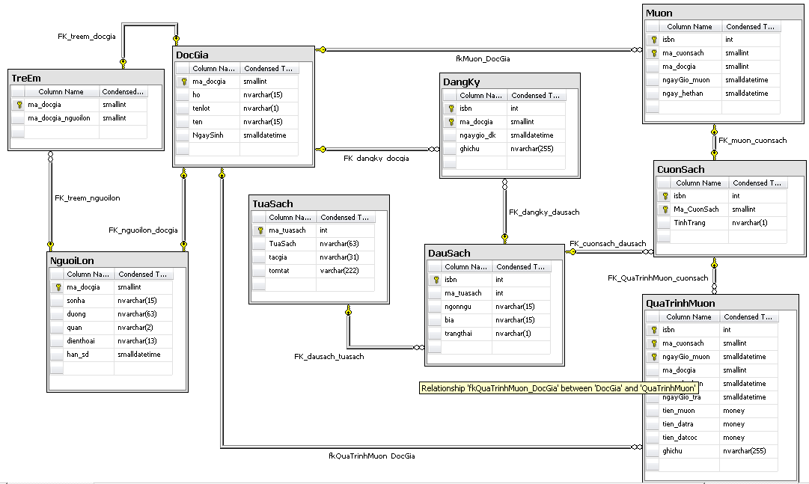

>Library management system.

## Table of contents
1. [Requirements](#requirements)
2. [Rules](#rules)
3. [Database Diagram](database-diagram)
4. [Store procedure requirements](#store-procedure-requirements)

---
### Requirements
#### Description
A library needs to manage users who can register, borrow, and return books.
* A librarian call content of a book is `tuasach` (Book Title). Example, the context could be `Toan Cao Cap A1` (Math A1), `Harry Porter chapter 8` ... Every book title is translated into different languages, and every translation is called `dausach` (Header of books). Every header has many coppies, and every coppy is called a `cuonsach` (book).
* Every book title has its own ID `matuasach`, It's automatically increased, and starts from 1,2,3... Every book title of an author `tacgia` has a summary `tomtat` of the book (It could be a sentence or several pages). When readers want to know content of the book, the librarian will take a look at the summary and answer to the readers.
* Every header of book has a status `trangthai` which shows its availability.
* To become a Reader or User `docgia` of the library, he/she needs to register with his information including the address, mobile phone number. The librarian supplies an electronic card. There is an ID card for each to distinct with others. (ID will be increased automatically from 1,2,3, ...). The ID card is valid in one year from the registration day. The librarian will notice to Readers if the card is going to be invalid 1 month before. 
* A reader `nguoilon` who is an adult (>18) can assure for children `treem` to become readers of the library. `nguoilon` and `treem` will have the same valid day. The librarian needs to know information of children including name, dob. When children is older than 18, the system will auto update the information for them to become adult readers.

##### Registration
If a user wants to borrow a book which it's not available. he can register in a queue. The the book is returned, the librarian will notice to this user. The librarian at any time can know how many copies of the book `cuonsach`, along with every header of book `dausach` which is being borrowed, or registered.

##### Borrow
* A user can borrow a book in 14 days. If it's a week after the validation day `ngay_hethan`, and the book hasn't returned yet, the librarian will send message to notice that user.
* To borrow books, users need to bring books to librarian. The librarian will use a machine to read the ID card, and show information about that user. if the card is almost invalid, the librarian will remind the user. In addition, the program also shows the information about user borrows including `tuasach`, and the day he has to return books `ngay_hethan`. The information will be highlight, and shown to the librarian.
* If all information is valid, the librarian will give books to readers. The librarian will scan the ISBN, and ID of coppies. If the book is not able to be borrowed, the program will notice to the librarian.

##### Return
* When the book is returned, the librarian will check all information about ISBN, title of the book, the author name. All information of the user will be shown. 
* The librarian will put back books onto shelves, and modify the availability status.
* The next reader who wants to borrow this book in a queue can borrow the book now.

##### Statistics
1. How many books are borrowed in last year?
2. How many readers borrowed only 1 book?
3. Which one is the best book?
4. The average time of borrows?
5. When are there the most users?

---

#### Rules
1. Book ID, and No start from 1. When a book is added, check `No`, if it's available then insert into this slot.
2. UserID is similar to 1.
3. Every adult only assure for 2 children.
4. An adult is allowed to borrow 5 book at maximum.
5. Children are allowed to borrow only 1 book.
6. Adult's books + Children's book <= 5
7. If users want to borrow books that do not exist in the library, they need to register.

---

#### Database diagram

* Please find [here](src/libraryscript.sql) the script for this library

* `DocGia`(ma_DocGia,ho,tenlot,ten,ngaysinh) - `User`(user_ID,lastname,middlename,firstname,dob)

* `NguoiLon`(ma_DocGia,sonha,duong,quan,dienthoai,han_sd) - `Adult`(user_ID,housenumber,street,district,phonenumber,validday)

* `Treem`(ma_DocGia,ma_DocGia_nguoiLon) `Children`(user_ID,adult_ID_user)

* `Tuasach`(ma_tuasach,tuasach,tacgia,tomtat) - `BookTitle`(book_ID, title, author, summary)

* `DauSach`(isbn,ma_tuasach,ngonngu,bia,trangthai) - `BookHeader`(isbn,book_ID,language,cover,status)

* `CuonSach`(isbn,ma_cuonsach,tinhtrang) - `Book`(isbn,ID,status)

* `DangKy`(isbn,ma_DocGia,ngay_dk,ghichu) - `Registration`(isbn, user_ID, day, notice)

* `Muon`(isbn,ma_cuonsach,ma_DocGia,ngay_muon,ngay_hethan) - `Borrow`(isbn,ID,user_ID,validday,invalidday)

* `QuaTrinhMuon`(isbn, ma_cuonsach, ngay_muon, ma_DocGia, ngay_hethan, ngay_tra, tien_muon, tien_datra, tien_datcoc, ghichu) - `BorrowProcess`(isbn, ID, day, user_ID, validday, invalidday, price, money1, money2 , notice )

--- 

#### Store Procedure requirements

Set-up store procedure for the library DB. Please check the source code [here](src/sp.sql).

##### Readers' retrieving 

* name: `sp_ThongtinDocGia`
* content: List all information of users using user ID. If the user is an adult, show the information in the table `Adult`. It's similar for children.

##### Information of Book Headers

* name: `sp_ThongTinDauSach`
* content: List all information of Book Headers, Book titles, and the number of available books (ISBN)

##### List all adults who are borrowing books

* name: `sp_ThongtinNguoiLonDangmuon`
* content: List all information

##### List all adult readers who are in invalid status

* name: `sp_ThongtinNguoiLonQuahan`
* content: List all information of those who borrowed books over 14 days.

##### List all adult readers, and their children who are borrowing

* name: `sp_DocGiaCoTreEmMuon`
* content: List all adult readers who are borrowing, and their children also are borrowing books.

##### Update book headers

* name: `sp_CapnhatTrangthaiDausach`
* content: Check status of a book header by using its isbn. If the book is not available then the status is `N`, and `Y` for available status.

##### Add a new book title

* name: `sp_ThemTuaSach`
* content: Add a new book title into the system when 3 attributes including `BookTitle`, `Author` and `Content` are different from records in the DB.

##### Add a new book

* name: `sp_ThemCuonSach`
* content: Add a new book into the system. The status of book title must be updated

#### Add a new adult 

* name: `sp_ThemNguoiLon`
* content: Add new information into `Adult` and `User` tables of the system.

#### Add a new child

* name: `sp_ThemTreEm`
* content: Add a new information into `Children` and `User` tables of the system.

